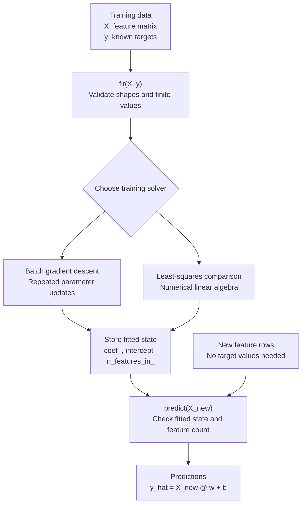
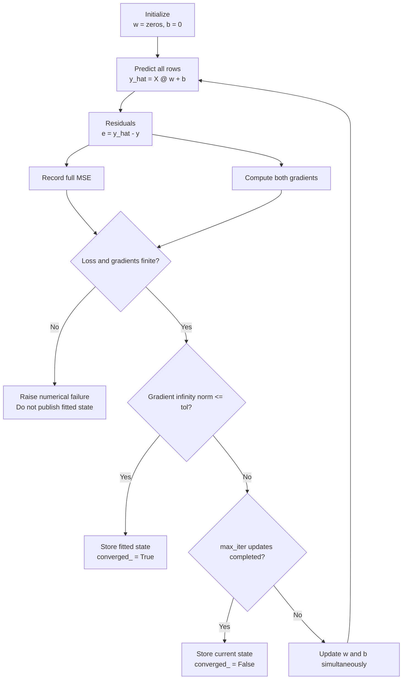

# Linear regression

Status: **in progress — contract and derivation drafted; implementation and
experimental evidence are pending**.

## Problem and intuition

Linear regression predicts one continuous numerical target from one or more
numerical features. The first baseline is a constant predictor fitted only on the
training set:

$$
\hat y_{\text{baseline}}=\bar y_{\text{train}}.
$$

The estimator should improve on that baseline on held-out data before its added
complexity is treated as useful.

Imagine predicting delivery time from distance. A one-feature model is

$$
\widehat{\text{minutes}}=w\times\text{distance in km}+b.
$$

The weight $w$ describes how much the prediction changes for one additional
kilometre. The intercept $b$ is the prediction at zero distance and might absorb
a fixed preparation component. These interpretations describe associations in the
fitted model; they do not establish causal effects.

With more features, the same model becomes

$$
\hat y=
w_1(\text{distance})+
w_2(\text{number of stops})+
w_3(\text{package weight})+b.
$$

Geometrically, the model fits a line for one feature and a hyperplane for several
features. It adjusts its coefficients so that predictions are close to observed
targets under a squared-error objective. One estimator handles both the simple and
multiple-feature cases; the feature matrix changes shape, but the algorithm does
not change.

The central design separation is:

- The **model** defines how predictions are calculated.
- The **objective** defines what counts as a good fit.
- The **solver** searches for suitable parameters.

Ordinary least squares defines the objective. Batch gradient descent and numerical
least squares are two ways to solve it.

### Training and prediction paths



Both solvers produce the same kind of fitted model. Prediction does not care how
the weights were found. Training changes parameters; `predict()` only applies the
stored parameters and must never run an optimization loop.

## Assumptions and applicability

Linear regression is useful as a baseline for numerical targets and when an
additive linear relationship is a reasonable approximation over the relevant
input range. It can also remain useful when transformed features represent the
needed nonlinear structure while the model stays linear in its learned
coefficients.

For prediction, the important assumptions and conditions are:

- Rows and labels represent the population and decision setting where the model
  will be evaluated.
- The supplied features contain a relationship that a linear combination can
  represent adequately.
- Training and prediction use the same feature definitions, units, ordering, and
  preprocessing.
- Large residuals are legitimately more costly under the chosen squared-error
  objective.
- Outliers, extrapolation, and redundant features are controlled or their effects
  are accepted and investigated.

Independent observations, residual normality, constant residual variance, and
related statistical conditions matter for classical inferential claims such as
standard errors and confidence intervals. They are not required merely to compute
least-squares predictions or MSE. This project initially evaluates predictive
behavior and does not claim valid statistical inference.

Reconsider ordinary linear regression when extrapolation is dangerous, required
predictions have constraints such as nonnegativity, outliers dominate, error costs
are strongly asymmetric, or the relationship is not adequately represented by
the supplied features.

## Mathematics

### Symbols and shapes

| Symbol | Shape | Meaning |
|---|---:|---|
| $n$ | scalar | Number of training samples |
| $d$ | scalar | Number of input features |
| $X$ | $(n,d)$ | Feature matrix |
| $y$ | $(n,)$ | One target per sample |
| $w$ | $(d,)$ | One learned weight per feature |
| $b$ | scalar | Shared learned intercept |
| $\hat y$ | $(n,)$ | One prediction per sample |
| $e$ | $(n,)$ | Residuals, defined as prediction minus target |

One feature is represented as `X.shape == (n, 1)`, not `(n,)`. Ten features use
`X.shape == (n, 10)`. The first estimator supports one target, not multiple output
targets.

### Prediction rule

For sample $i$:

$$
\hat y_i=\sum_{j=1}^{d}X_{ij}w_j+b.
$$

In vector form:

$$
\boxed{\hat y=Xw+b}.
$$

### Ordinary least squares and full MSE

Ordinary least squares is the unweighted, unregularized problem

$$
\min_{w,b}
\quad
\sum_{i=1}^{n}(\hat y_i-y_i)^2.
$$

Define residuals using prediction minus observation:

$$
e_i=\hat y_i-y_i.
$$

This project uses **full MSE**:

$$
\boxed{
J(w,b)=\frac{1}{n}\sum_{i=1}^{n}e_i^2
=\frac{1}{n}\sum_{i=1}^{n}(X_iw+b-y_i)^2
}.
$$

Dividing the squared-error sum by the fixed positive number $n$ does not change
the minimizing parameters. It makes loss values more comparable across datasets
of different sizes when their target units and distributions are comparable.

Squaring residuals prevents positive and negative errors from cancelling, gives
larger residuals disproportionately more influence, and creates a smooth convex
objective. If the target is measured in minutes, MSE is measured in minutes
squared. MAE and RMSE are often easier to communicate because they retain the
target's units.

Convexity means there are no bad local minima for this objective. It does not mean
that every learning rate converges, that the minimizing coefficient vector is
unique, or that the minimum loss is zero.

### Weight-gradient derivation

For weight $w_j$, apply the chain rule:

$$
\frac{\partial J}{\partial w_j}
=\frac{1}{n}\sum_{i=1}^{n}
2e_i\frac{\partial e_i}{\partial w_j}.
$$

Because

$$
e_i=\sum_{k=1}^{d}X_{ik}w_k+b-y_i,
\qquad
\frac{\partial e_i}{\partial w_j}=X_{ij},
$$

the derivative is

$$
\frac{\partial J}{\partial w_j}
=\frac{2}{n}\sum_{i=1}^{n}X_{ij}e_i.
$$

Collecting the derivatives for every weight gives

$$
\boxed{\nabla_wJ=\frac{2}{n}X^\top e
=\frac{2}{n}X^\top(Xw+b-y)}.
$$

Each component aggregates residuals weighted by the corresponding feature values.

### Intercept-gradient derivation

Because $\partial e_i/\partial b=1$,

$$
\boxed{
\frac{\partial J}{\partial b}
=\frac{2}{n}\sum_{i=1}^{n}e_i
=\frac{2}{n}\sum_{i=1}^{n}(X_iw+b-y_i)
}.
$$

The intercept gradient aggregates the residuals directly. The factor $2$ in
both gradients comes from differentiating the square. It must remain present
because this project uses full MSE rather than silently switching to half-MSE.

### One hand-calculated update

Let

$$
X=\begin{bmatrix}1\\2\end{bmatrix},
\qquad
y=\begin{bmatrix}3\\5\end{bmatrix},
\qquad
w=0,
\qquad
b=0.
$$

The initial predictions, residuals, and loss are

$$
\hat y=\begin{bmatrix}0\\0\end{bmatrix},
\qquad
e=\begin{bmatrix}-3\\-5\end{bmatrix},
\qquad
J=\frac{(-3)^2+(-5)^2}{2}=17.
$$

The gradients are

$$
\nabla_wJ=\frac{2}{2}\left(1(-3)+2(-5)\right)=-13,
$$

$$
\frac{\partial J}{\partial b}
=\frac{2}{2}(-3-5)=-8.
$$

With learning rate $\alpha=0.1$, update both parameters from the same old
parameter state:

$$
w_{\text{new}}=0-0.1(-13)=1.3,
\qquad
b_{\text{new}}=0-0.1(-8)=0.8.
$$

The new predictions are $[2.1,3.4]$, the new residuals are
$[-0.9,-1.6]$, and

$$
J_{\text{new}}=\frac{(-0.9)^2+(-1.6)^2}{2}=1.685.
$$

One update improved this fit; it did not finish training. Updating one parameter
before calculating the other parameter's gradient would mix parameter states and
would no longer be the simultaneous batch-gradient update derived above.

## API and implementation decisions

### Planned public interface

The initial public estimator is `LinearRegression`. The first implemented solver
will be deterministic batch gradient descent. A numerical least-squares path is
added as an independent comparison and may later be exposed by the same estimator;
both paths must produce the same prediction and fitted-state interface.

The initial constructor contract is conceptually:

```python
LinearRegression(
    *,
    learning_rate: float = 0.01,
    max_iter: int = 1000,
    tol: float = 1e-6,
)
```

The public methods are:

- `fit(X, y) -> LinearRegression`: validate data and hyperparameters, reset any
  previous fitted state, train, store learned state, and return `self`.
- `predict(X) -> NDArray[np.float64]`: require fitted state and return one
  prediction per row with shape `(n_samples,)`.

The fitted attributes are:

| Attribute | Type/shape | Meaning |
|---|---|---|
| `coef_` | float64 array, `(d,)` | Learned feature weights |
| `intercept_` | `float` | Learned shared intercept |
| `n_features_in_` | `int` | Training feature count |
| `n_iter_` | `int` | Number of completed parameter updates |
| `loss_history_` | float64 array, `(n_iter_ + 1,)` | Initial loss followed by each post-update loss |
| `converged_` | `bool` | Whether the stopping criterion was satisfied |

`score()` and `get_params()` are deliberately deferred. The source notes describe
them as possible library-wide conveniences, but the current project agreement does
not add public methods without a concrete consumer. `predict_proba()`, `transform()`,
and `fit_transform()` do not describe a linear-regression estimator and are not
part of this API.

### Accepted inputs

- `X` is a dense, real, numerical, two-dimensional NumPy-compatible array with
  shape `(n_samples, n_features)`, where both dimensions are at least one.
- `y` is a dense, real, numerical, one-dimensional NumPy-compatible array with
  shape `(n_samples,)`.
- Integer and floating inputs are converted to float64 before arithmetic.
- One sample, constant features, duplicate rows, and rank-deficient feature
  matrices are accepted. Their limitations must be tested and documented.
- Prediction accepts a nonempty finite two-dimensional array whose feature count
  and feature ordering match the fitted data.

### Rejected inputs and errors

- Empty arrays, ragged arrays, object/string/categorical data, Boolean data,
  complex values, sparse matrices, missing values, NaN, and infinity are rejected.
- One-dimensional `X`, two-dimensional `y` such as `(n, 1)`, multioutput targets,
  mismatched sample counts, and a mismatched prediction feature count are rejected.
- Invalid data, shapes, or hyperparameters raise `ValueError` with a specific
  explanation. Inputs are not silently flattened, broadcast, clipped, imputed, or
  repaired.
- Calling `predict()` before a successful `fit()` raises `RuntimeError`.
- Nonfinite loss, gradients, parameters, or predictions produced during training
  raise `FloatingPointError`. Partial parameters must not be published as fitted
  state after this numerical failure.

The estimator never mutates caller-owned arrays and never changes NumPy's global
random state. Batch gradient descent is deterministic and needs no random seed.
Feature order is part of the serving contract.

### Hyperparameter validation

- `learning_rate` must be a finite real number strictly greater than zero.
- `max_iter` must be a positive integer; Boolean values are rejected even though
  `bool` is an `int` subclass in Python.
- `tol` must be a finite real number greater than or equal to zero. A zero
  tolerance requires an exactly zero checked gradient.

### Batch-gradient-descent contract

Batch means that every training row contributes to every update. Initialize
`w = zeros(d)` and `b = 0.0`; random initialization is unnecessary for ordinary
linear regression.



The update rule is

$$
w\leftarrow w-\alpha\nabla_wJ,
\qquad
b\leftarrow b-\alpha\frac{\partial J}{\partial b}.
$$

The convergence statistic is the infinity norm of the combined gradient:

$$
g_{\max}=\max\left(
\max_j|\nabla_{w_j}J|,
\left|\frac{\partial J}{\partial b}\right|
\right).
$$

Training converges when `g_max <= tol`. This avoids declaring convergence merely
because a tiny learning rate creates tiny loss changes. The initial loss is stored
before any update; every completed update adds its resulting loss. Consequently,
`len(loss_history_) == n_iter_ + 1`.

If the criterion is not met after exactly `max_iter` updates, `fit()` retains the
finite current parameters, sets `converged_ = False`, and returns `self`. Reaching a
fixed iteration budget is not evidence of convergence. Repeat fitting validates
the new inputs first, then clears all previous learned state before initialization
and training. A validation failure therefore does not corrupt an already fitted
model; a numerical failure during the new training run leaves no fitted state.

Loss is not required to decrease at every individual update. An excessive
learning rate can oscillate or diverge; the implementation must expose rather than
hide that behavior.

### Numerical least-squares comparison

Add the intercept as a column of ones:

$$
A=\left[X\ \mathbf 1\right],
\qquad
\theta=\left[w_1,\ldots,w_d,b\right]^\top.
$$

Then solve

$$
\min_{\theta}\ \|A\theta-y\|_2^2
$$

with a stable numerical routine such as `np.linalg.lstsq`. Do not explicitly
compute

$$
(A^\top A)^{-1}A^\top y,
$$

because it requires invertibility and can worsen numerical conditioning.

The comparison distinguishes a model limitation from an optimization failure: if
least squares reaches a lower objective on identical data, investigate gradient
descent, scaling, the learning rate, stopping, and numerical behavior before
rejecting the model class.

Rank-deficient or redundant features can admit several parameter vectors with the
same optimal predictions. In that case, compare predictions and objective values;
do not blindly demand identical coefficients.

### Internal organization

The implementation should keep validation, prediction calculation, loss,
gradients, parameter updates, convergence checks, and public prediction as small
testable responsibilities. Initially keep algorithm-specific calculations in one
readable module and split them only when demonstrated reuse or complexity warrants
it. Do not create an empty framework or a separate public function for every
equation.

Shared preprocessing and metrics remain outside the estimator. In particular,
`StandardScaler` is shared across regression, clustering, and other algorithms;
the model should not silently fit preprocessing internally.

## Verification

The following evidence is required during implementation; it is not yet complete:

### Mathematical correctness

- Reproduce the hand-calculated two-row update above.
- Check the analytical weight and intercept gradients against central finite
  differences on a small float64 example using documented tolerances.
- Verify that simultaneous updates use gradients calculated from the same
  parameter state.
- Verify predictions from a known affine relationship.

### Behavioral and state correctness

- `fit()` returns `self` and creates every documented fitted attribute.
- `predict()` returns shape `(m,)` and rejects use before fitting.
- Repeat fitting resets coefficients, iteration counts, history, and convergence
  state rather than continuing an earlier run.
- Training and prediction do not mutate their inputs.
- Deterministic inputs and hyperparameters produce deterministic results.
- A sensible learning rate generally reduces the objective on the controlled
  convex example, without making monotonic loss a universal API guarantee.

### Validation and edge cases

- Reject empty, ragged, nonnumerical, Boolean, complex, NaN, and infinite inputs.
- Reject one-dimensional `X`, column-vector or multioutput `y`, sample-count
  mismatches, and prediction-time feature mismatches.
- Validate constant features, duplicated observations, one sample, extreme values,
  and invalid hyperparameters according to the stated policy.
- Accept rank-deficient matrices without assuming unique coefficients.
- Detect nonfinite arithmetic and leave no fitted state from the failed run.

### Independent reference evidence

- Compare objective values and predictions with `np.linalg.lstsq` on a
  well-conditioned converged example.
- Add a rank-deficient case where equivalent predictions are accepted even when
  coefficients differ.
- Use scikit-learn only as supporting external evidence with matched intercept,
  preprocessing, objective, and data; it must never be called inside the
  from-scratch implementation.
- Do not rely on reference agreement alone: hand examples, invariants, and finite
  differences provide independent evidence.

## Experiments and results

No experiments have been run yet. Results, figures, timings, and claims remain
pending until the implementation and metrics exist.

The planned controlled experiments are:

1. **Learning rate:** compare a small rate, a useful rate, and an intentionally
   excessive rate. Observe convergence speed, oscillation, and numerical failure.
2. **Feature scaling:** compare unscaled inputs with statistics fitted on training
   data only. Measure iterations or gradient evaluations needed to reach a fixed
   objective threshold.
3. **Outliers:** change only the presence of extreme observations and inspect
   coefficients, MAE, RMSE, and residuals.
4. **Correlated and redundant features:** compare prediction stability with
   coefficient stability and include a rank-deficient case.
5. **Nonlinear relationships:** show high validation error or structured residuals
   when the supplied representation cannot express the relationship.
6. **Sample size:** hold the data-generating process fixed and examine held-out
   behavior as training size changes.
7. **Later regularization comparison:** after Ridge and other penalties exist,
   investigate how regularization changes coefficients and held-out error. This is
   not part of the unregularized implementation.

Each experiment must state its question, controlled setup, data provenance,
train/validation split, seed, preprocessing boundary, command, metric and baseline,
observed result, and interpretation. Change one factor at a time. Low training
error alone is not evidence of generalization.

For delivery-time-style evaluation, ask:

- Do held-out MSE, MAE, RMSE, and $R^2$ improve on the training-mean baseline
  under their documented conventions?
- Are long-distance or peak-hour deliveries systematically underestimated?
- Can the model produce impossible negative durations?
- Is late-arrival underprediction more costly than early-arrival overprediction?

MSE assigns equal cost to equal-sized positive and negative residuals; a real
decision may not. The primary evaluation metric must be selected from the error
costs rather than chosen after seeing favorable results.

## Complexity and benchmarks

Let $T$ be the number of completed gradient updates, $n$ the number of training
rows, $d$ the number of features, and $m$ the number of prediction rows.

| Operation | Time | Additional/storage space |
|---|---:|---:|
| One batch-GD update | $O(nd)$ | $O(n+d)$ for predictions, residuals, gradients, and parameters |
| Batch-GD fit | $O(Tnd)$ | $O(n+d+T)$, including loss history |
| Predict $m$ rows | $O(md)$ | $O(m)$ output |
| Learned predictive state | — | $O(d)$ weights plus one intercept |
| Dense least squares, commonly when $n\ge d$ | approximately $O(nd^2)$ | implementation dependent |

The learned predictive state excludes preprocessing statistics and optional loss
history. Batch gradient descent makes repeated full-data passes and requires
learning-rate and stopping choices. Dense least squares avoids those choices and is
a strong comparison target, but becomes costly when feature dimension is large.

No runtime or memory benchmark has been measured. Later benchmarks must use fixed
data and seeds, matched conditions, warmup, repeated trials, a stated summary and
spread, and recorded hardware, OS, Python, NumPy, reference-library, and thread
settings. Fit, preprocessing, and prediction timing boundaries must be explicit.
The goal is correctness and explanation, not an unsupported claim of outperforming
optimized libraries.

## Failure analysis

| Failure mode | Symptom | Mechanism | Mitigation or next investigation |
|---|---|---|---|
| Silent broadcasting | Residual becomes `(n, n)` | `(n,)` predictions are combined with `(n, 1)` targets | Enforce exact target dimensionality |
| Unscaled features | Slow or unstable convergence | Feature columns produce gradients with very different magnitudes | Standardize using training-only statistics |
| Excessive learning rate | Loss oscillates, grows, or becomes nonfinite | Updates repeatedly overshoot | Reduce the rate and report numerical failure |
| Very small learning rate | Tiny loss changes and unfinished optimization | Each update moves too little | Use gradient-based stopping and compare with least squares |
| Outliers | Distorted coefficients and large MSE/RMSE | Squaring gives large residuals disproportionate influence | Investigate data quality, robust loss, or robust models |
| Multicollinearity | Coefficients change sharply while predictions remain similar | Features contain overlapping information | Compare predictions/loss; consider regularization or feature removal |
| Rank deficiency | Coefficients are not uniquely identified | Redundant columns admit equivalent solutions | Do not require coefficient equality |
| Nonlinear relationship | Structured residuals and high validation error | The feature representation is too simple | Add justified features or use another model |
| Extrapolation | Implausible predictions outside training support | The fitted linear trend is extended beyond evidence | Monitor ranges and constrain the decision system |
| Asymmetric costs | Acceptable MSE but harmful operational errors | Squared error treats signs symmetrically | Choose a loss and decision policy reflecting error costs |
| Premature inference | Prediction before fit or wrong feature semantics | Required learned state or schema is missing | Validate fitted state, count, order, and preprocessing |
| Reference-only confidence | Matching a library hides a shared convention mistake | Both paths can share assumptions or preprocessing errors | Add hand calculations, invariants, and gradient checks |

These rows are hypotheses and expected mechanisms. Each becomes evidence-backed
only after a controlled experiment records an observed symptom and result.

## Operational considerations and limitations

This from-scratch NumPy estimator is educational engineering, not a claim that it
should replace optimized production libraries.

Preprocessing stays outside the estimator but must be versioned and served with
it. Split data before fitting a scaler; learn scaling statistics from the training
partition only and reuse them unchanged for validation and prediction. Serving
must preserve feature definitions, order, units, dtype policy, and missing-value
policy.

Prediction can be performed in batches or row by row using the same stored weights
and intercept. A deployed artifact would need a safe serialization strategy,
schema/version metadata, compatibility checks, rollback, and reproducible training
configuration. Untrusted pickle files must not be loaded.

Relevant monitoring signals include:

- Input-feature distribution changes.
- Missing or invalid value rates.
- Percentage of inputs outside the training range.
- Prediction distribution and impossible values.
- Residual distribution once labels arrive.
- Delayed-label MAE and RMSE.
- Segment-specific errors, including systematic underprediction.

Retraining should be justified by changed data, degraded decision-relevant held-out
performance, or a changed objective—not by a calendar alone. A separate deployed
system would be needed to demonstrate latency, reliability, rollback, monitoring,
and live operational ownership. Docker, Kubernetes, and similar infrastructure are
not added merely for appearance.

## Reproduce and references

The derivation and design in this draft use the owner-provided local source
`ml-principles.md`, specifically its linear-regression design, first-vertical-slice,
testing, experiment, failure-analysis, and regression-evaluation guidance. That
source is local working material and is not part of this document's implementation
evidence.

Implementation and reproduction commands are pending. When the estimator exists,
the minimum evidence will include focused tests, the locked repository checks, the
linear-regression example, the least-squares comparison, and inspection of the
generated figures. Until then, this document must remain `in progress`.

### Understanding checks

1. Why do five additional features require more weights but not a different
   estimator?
2. If the intercept gradient is negative, which direction does the intercept move
   under gradient descent, and why?
3. If gradient descent has higher training MSE than numerical least squares on the
   same data, what evidence would distinguish scaling, optimization, numerical, and
   model-capacity problems?
